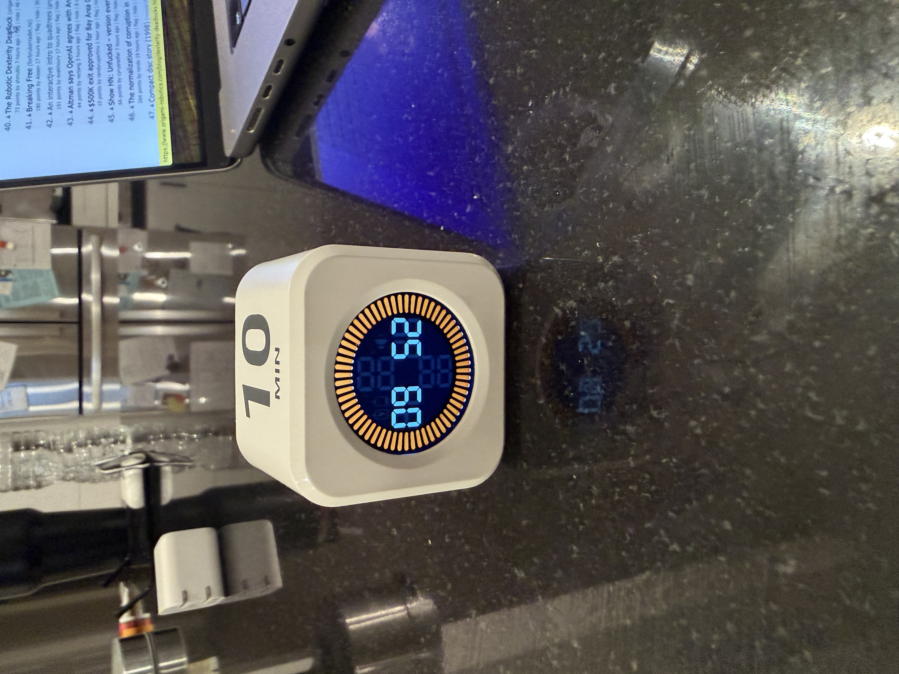
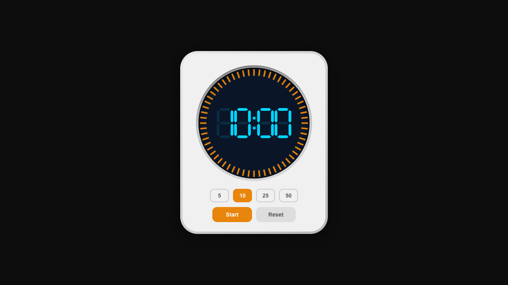

# Pomodoro Timer

A web-based Pomodoro timer built to replicate the look and feel of a physical cube timer.

## The Story

This project started with a physical cube timer sitting on a desk — a white cube with rounded edges, a circular display ringed with orange tick marks, and cyan 7-segment digits on a deep navy screen. The goal was to recreate it as a web app, pixel for pixel, using nothing but vanilla HTML, CSS, and JavaScript.

  
  

The reference photos above drove every design decision — from the exact orange of the tick marks (`#e8850c`) to the way unlit LED segments remain faintly visible as ghost outlines, to the 3D beveled edges of the cube and the recessed screen.

## Features

- **7-segment display** — Pure CSS `clip-path` polygons with ghost segments, no fonts
- **60-tick progress ring** — SVG lines that deplete counter-clockwise, with the current tick blinking
- **Drift-proof timing** — Uses `Date.now()` timestamps, not interval counting
- **Preset durations** — 5, 10, 25, and 50 minutes
- **Completion alerts** — 3-beep alarm (Web Audio API), screen flash animation, browser notification
- **Keyboard control** — Space bar to start/pause
- **Zero dependencies** — No build tools, no frameworks, just three files

## Usage

Open `index.html` in any modern browser. That's it.

1. Pick a preset (5 / 10 / 25 / 50 minutes)
2. Click **Start** or press **Space**
3. Click **Pause** to pause (colon blinks), **Start** to resume
4. Click **Reset** to return to the selected preset
5. At `00:00` — hear the alarm, see the flash, get a notification

## Files

| File | Purpose |
|------|---------|
| `index.html` | DOM structure |
| `style.css` | All visual design and animations |
| `app.js` | Timer logic, audio, notifications |
| `assets/` | Reference photos of the physical timer |

See [IMPLEMENTATION.md](IMPLEMENTATION.md) for detailed technical explanations of how each visual feature was built.
